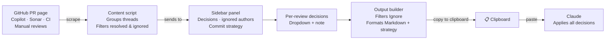

# PR Review Collector

A Firefox extension that scrapes review comments from GitHub Pull Requests, lets you assign a human decision to each one, and copies a ready-to-paste prompt directly into Claude.

No GitHub login required. No API calls. Fully client-side.



---

## Why

PR reviews come from multiple sources — GitHub Copilot, SonarQube/SonarCloud, and manual developer comments. Triaging them and communicating your intent to an AI assistant is repetitive and error-prone when done by hand.

This extension gives you a sidebar panel directly on the GitHub PR page. For each comment you pick a decision, add an optional note, and hit **Copy to clipboard**. The result is a structured prompt you paste straight into Claude.

---

## Features

- Scrapes inline diff comments, conversation-level comments, SonarQube/SonarCloud annotations, GitHub Copilot suggestions, and inline CI annotations
- Works on both the **Conversation** tab and the React-based **Files changed** / **changes** page
- Groups threaded comments together — first comment is the main review, replies are shown below
- Automatically skips resolved comment threads
- Detects severity/type labels (Nit, Low, Medium, High) from Copilot and Sonar
- Suggestion diffs displayed with `+`/`-` markers and color-coded lines
- Sidebar panel with per-review decision picker and free-text annotation
- **Ignored authors** — configurable list (stored in `localStorage`) to permanently hide bot noise (e.g. `nx-cloud`, `notion-workspace`)
- **Commit strategy** selector — choose between single commit, grouped by context, or one commit per review
- **Reset all decisions** button to start over
- Decisions persist in `sessionStorage` — a page refresh won't wipe your work
- Reviews marked **Ignore** are dimmed in the UI and excluded from the output
- Light and dark mode support
- Generates a structured Markdown prompt ready to paste into Claude

---

## Architecture



Extension files: `manifest.{firefox,chrome}.json` · `content_script.js` · `sidebar.css`

Permissions required: `activeTab` · `clipboardWrite` · `storage`

---

## Installation

The extension ships two manifest files — pick the one for your browser:

| File | Browser | Manifest version |
|---|---|---|
| `manifest.firefox.json` | Firefox | V2 |
| `manifest.chrome.json` | Chrome / Edge / Brave | V3 |

Before loading, copy the right one to `manifest.json`:

```bash
# Firefox
cp manifest.firefox.json manifest.json

# Chrome / Edge / Brave
cp manifest.chrome.json manifest.json
```

### Firefox (temporary / development)

1. Clone or download this repository
2. `cp manifest.firefox.json manifest.json`
3. Open Firefox and navigate to `about:debugging`
4. Click **This Firefox** → **Load Temporary Add-on**
5. Select `manifest.json`

The extension is active until Firefox is closed. Repeat step 4–5 after each restart.

### Chrome / Edge / Brave

1. Clone or download this repository
2. `cp manifest.chrome.json manifest.json`
3. Open Chrome and navigate to `chrome://extensions`
4. Enable **Developer mode** (top-right toggle)
5. Click **Load unpacked** and select the repository folder

### Permanent (self-distributed)

**Firefox:** Zip the extension folder contents and install via `about:addons` → gear icon → **Install Add-on From File**.

> For signing and distribution via addons.mozilla.org, see [Mozilla's extension signing docs](https://extensionworkshop.com/documentation/publish/signing-and-distribution-overview/).

**Chrome:** Zip the folder and distribute the `.crx` file, or publish to the [Chrome Web Store](https://developer.chrome.com/docs/webstore/publish/).

---

## Usage

1. Open any Pull Request on GitHub (the **Files changed** or **Conversation** tab works best)
2. Click the **📋** floating button at the bottom-right of the page
3. The sidebar opens and scrapes all visible review comments
4. For each comment, pick a decision from the dropdown:

   | Decision | When to use |
   |---|---|
   | **Apply** | Accept the suggestion as-is |
   | **Fix** | Fix the issue, optionally add a note with guidance |
   | **Explain** | Ask Claude to explain the comment or a related question |
   | **Plan fix** | Draft a plan before implementing |
   | **Investigate** | Needs further research before deciding |
   | **Ignore** | Dismiss — excluded from the output entirely |
   | **Other** | Anything that doesn't fit the above |

5. Add an optional free-text note to any decision for extra context
6. Select a **commit strategy** at the bottom (Single commit / Grouped by context / One commit per review)
7. Click **Copy to clipboard**
8. Paste into Claude

### Ignored authors

Expand the **Ignored authors** section to manage which bot accounts are filtered out. Authors in this list are silently excluded from scraping. Defaults: `notion-workspace`, `nx-cloud`, `socket-security`. The list is stored in `localStorage` and persists across sessions.

### Decision format in the output

```
Human decision: Fix / Use UTC for the base of the date
Human decision: Explain / Also what happens in this other case…?
Human decision: Other / This is a false positive, investigate the test suite instead
Human decision: Apply
```

---

## Output format

The clipboard content is structured Markdown with the following sections:

```
# PR Reviews — human decisions for Claude

Below are pull request review comments, each with a human decision on how to handle it.

## Instructions
- **Apply** each decision as stated (Apply, Fix, Explain, etc.)
- **Ask** for clarification if any information is missing before making changes
- **Plan first**: list all actions you will take, then wait for confirmation
- **Track progress**: update the TODO list as you complete each item

**Commit strategy: Grouped by context** — Group related changes into logical commits. ...

## PR metadata
- URL
- Title
- Branch
- Description

## Reviews
### Review N
- File
- Lines
- Author
- Type (Nit / Low / Medium / High)
- Suggested change (```diff block with +/- markers)
- Comment
- Replies (if threaded)
- Human decision
```

See [`docs/output_example.md`](./docs/output_example.md) for a full example.

---

## Supported review sources

| Source | Page | How it's detected |
|---|---|---|
| GitHub manual reviews | Conversation | `.review-comment` inside `.review-thread-component` threads |
| GitHub manual reviews | Files changed | `[data-testid="review-thread"]` with `[data-first-thread-comment]` |
| GitHub Copilot | Both | Same as manual reviews + severity label elements / comment text prefix |
| SonarQube / SonarCloud | Conversation | `[data-sonar-issue]` / `.sonar-review-comment` |
| SonarCloud / CI annotations | Files changed | `[data-testid^="annotation-"]` / `[class*="InlineAnnotation-module"]` |

Resolved threads are automatically excluded on both pages (`data-resolved="true"` on Conversation, "Resolved" label / "Unresolve" button on Files changed).

> **Note:** GitHub's DOM is not a public API. If GitHub ships a major UI redesign, the selectors in `content_script.js` may need updating. The scraping logic is intentionally isolated in clearly marked sections to make patching straightforward.

---

## Project structure

```
pr-review-collector/
├── manifest.firefox.json  # Firefox manifest (V2)
├── manifest.chrome.json   # Chrome/Edge/Brave manifest (V3)
├── content_script.js      # DOM scraping + sidebar logic
├── sidebar.css            # Sidebar styles (light + dark mode)
├── icon.svg               # Extension icon
└── docs/
    ├── architecture.svg   # Architecture diagram
    └── output_example.md  # Example clipboard output
```

---

## Contributing

The most useful contributions are updates to the scraping selectors when GitHub or SonarQube changes their DOM. When submitting a fix:

- Identify which extractor function is affected:
  - `extractInlineComment` / `extractReply` — Conversation tab threads
  - `extractChangesPageComment` / `extractChangesPageReply` — Files changed page threads
  - `extractConversationComment` — PR-level conversation comments
  - `extractSonarComment` — Classic SonarQube annotations
  - `extractInlineAnnotation` — CI check annotations on Files changed page
- Include the old and new selectors in your PR description
- Test on both the **Files changed** and **Conversation** tabs
- Note: the Files changed page uses `content-visibility: auto`, so always use `textContent` instead of `innerText` for elements that may be off-screen

---

## License

MIT